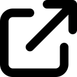

<p align="center">
  
</p>

<h1 align="center">Open My Tabs</h1>

<p align="center">
  One click. All your daily tabs. No accounts, no tracking, no build step.
</p>

<p align="center">
  
  
  
  
  
</p>

---

You open the same handful of sites every morning: email, calendar, your bank, the team dashboard. Open My Tabs puts them all behind the toolbar button. Click it and every site opens in its own tab.

## Why use it

- **Fast.** One click replaces typing or bookmark-hunting for each site.
- **Private.** Requests no permissions, so it can't read your tabs or browsing history. No network calls, analytics, or storage. Your URL list lives in a file on your machine.
- **Small.** The whole extension is an 11-line service worker and a manifest. You can read all of it in 30 seconds.
- **Easy to change.** Edit one array, reload, done.
- **Modern.** Built on Chrome's Manifest V3.

## Install

Open My Tabs isn't on the Chrome Web Store. Load it unpacked:

1. Clone or download this repo:
   ```bash
   git clone https://github.com/gsanders300/Open-My-Tabs.git
   ```
2. Open `chrome://extensions/` in Chrome.
3. Turn on **Developer mode** (top right).
4. Click **Load unpacked** and select the `Open-My-Tabs` folder.
5. Pin the extension from the puzzle-piece menu so the button stays in your toolbar.

It also works in Chromium-based browsers that support Manifest V3 extensions, such as Edge and Brave.

## Set your tabs

Edit the `urls` array in [`background.js`](background.js):

```js
const urls = [
  "https://www.example.com",
  "https://www.example.org",
  "https://www.example.net"
];
```

Replace the examples with your own sites, then click the reload icon on the extension's card in `chrome://extensions/`. Tabs open in the order listed.

> **Keep your list private.** If you push your edits to a public fork, anyone can see your URLs. Don't commit links to internal tools or links with tokens or account IDs in them. Keep your list in a local clone or a private fork.

## How it works

```
toolbar click ──► chrome.action.onClicked ──► chrome.tabs.create() for each URL
```

[`background.js`](background.js) registers a listener on the toolbar button. When you click, it calls `chrome.tabs.create` once per URL. That's the whole extension.

| File | Purpose |
| --- | --- |
| `manifest.json` | Extension metadata and icon (no permissions) |
| `background.js` | Service worker that opens the tabs |
| `icon.png` | Toolbar icon |
| `AGENTS.md` | Coding conventions for AI coding assistants |

## Troubleshooting

- **Nothing happens on click.** Open `chrome://extensions/`, click the **service worker** link on the Open My Tabs card, and check the console for errors.
- **Changes don't show up.** Click the reload icon on the extension card after editing `background.js` or `manifest.json`.
- **A site doesn't open.** Check that the URL starts with `https://` and has no typos.

## Contributing

Issues and pull requests are welcome. Keep it small: the point of this project is that it stays easy to read. See [`AGENTS.md`](AGENTS.md) for code style (2-space indent, double quotes, semicolons).

## License

[MIT](LICENSE)
